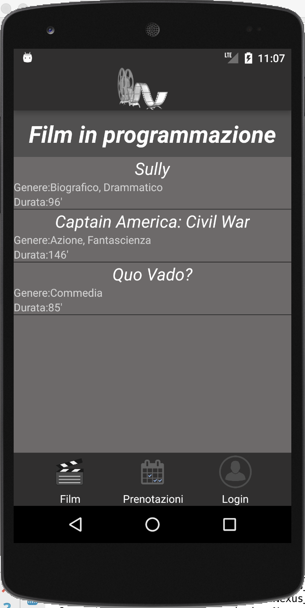
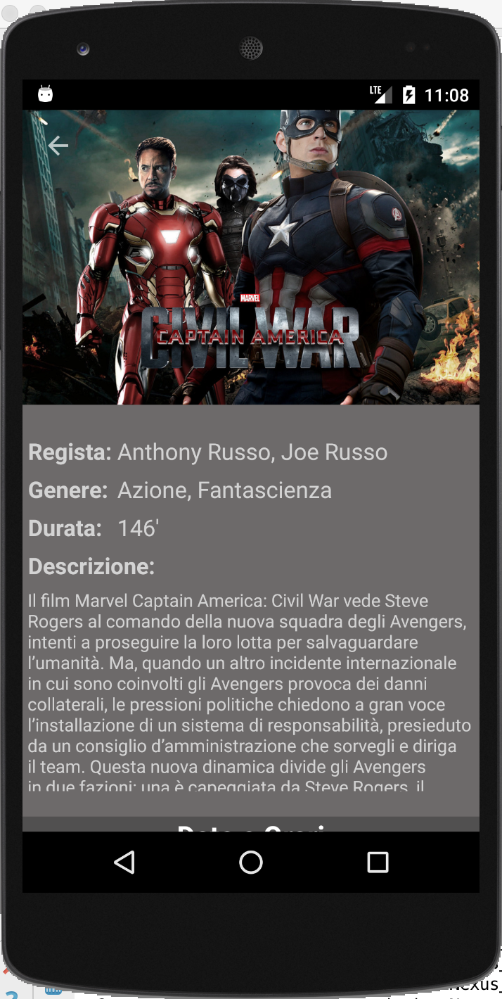
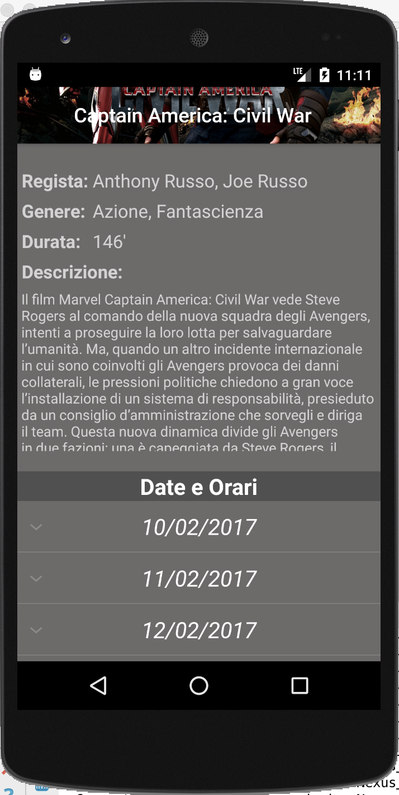
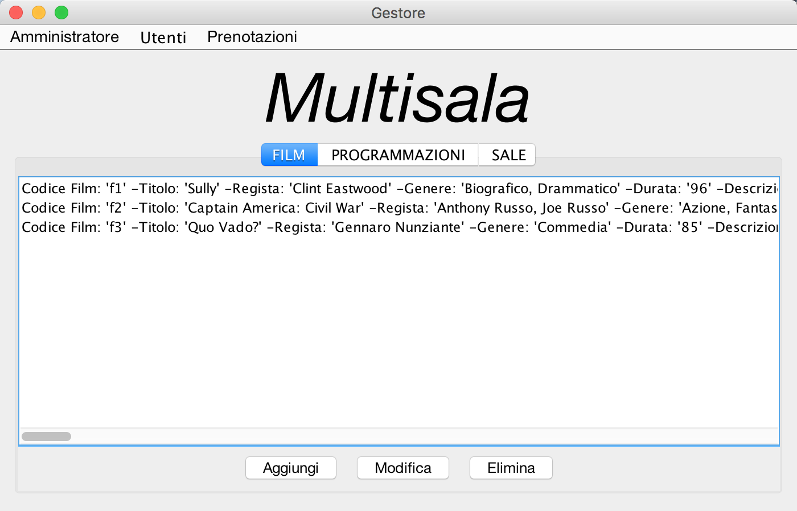

# Multiplex ticket booking system

Final project for the course "Computazione Pervasiva" @Università degli Studi del Sannio.

 

The objective of this work is to build a ticket booking system for a multiplex. The system provides a REST based Server, a Desktop Client which communicates with the Server and allows to manage films, rooms, programs and an Android Client which communicates with the Server and allows costumers to book their tickets.

 

<figure>
  

    
    <figcaption>Client Android</figcaption>
  

</figure>

  

<figure>
  

    
    <figcaption>Client Android</figcaption>
  

</figure>

  

<figure>
  

    
    <figcaption>Client Android</figcaption>
  

</figure>

  

<figure>
  

    
    <figcaption>Client Desktop</figcaption>
  

</figure>
